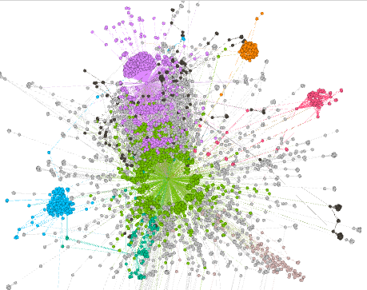
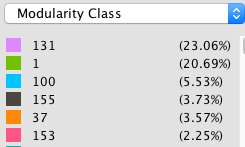
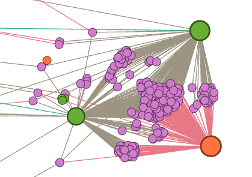

# Panama-Papers-Network-Analysis

## The Project
Social network analysis of the Panama Papers, with a specific emphasis in Saudi Arabia and Jordan. The network looks at the nodes between these two country and any other nodes irregardless of country of origin two degrees of freedom away.

The exploitation of openly and legally available information is as ancient as the use of intelligence as a tool for collecting information with regard to national defense and security. Open Source Intelligence (OSINT) reporters believe that it will enhance the depth and breath of their reporting through its vast volume and capabilities.

Understanding the social relationships identified within the Panama Papers may lead to a clearer understanding of how these methods of offshore structures are used to transfer money between Jordan and Saudi Arabia

## The Process

1) Generate subgraph of model of interest: nodes with two degree or less from all nodes with country codes for Saudi Arabia (SAU) and The Hashemite Kingdom of Jordan (JOR).
The code can be found in in the [load_and_clean2.py]().

2) Generate initial graph, ego, in Gephi using built in ForceAtlas2 algorithm.
The code can be found in in the [load_and_clean2.py]().

3) Computed several centrality measure and report our observations in order to identify the key players.
The code can be found in in the [measuring2.py]().

4) Analyze community structures based on Louvian modularity, Q, and centralities.
The code can be found in in the [measuring2.py]().

5) Investigated the top ten nodes with the highest degrees and characterized their role in their respective communities. The code can be found in in the [measuring2.py]().

## The Data

The Panama Papers are a set of 11.5 million document leaks from Panamanian law company ”Mossack Fonseca”, which provides information on approximately 360,000 businesses and individuals in more than 200 countries linked to offshore structures and covering a time period of nearly 40 years, from 1977 to 2016.

Link: https://www.occrp.org/en/panamapapers/database

The  ”ICIJ  Offshore”  database,  presents  the  network  of  relationships  between  companies  and  individual  people  with  offshore  companies based in tax havens. Consists in a directed and unweighted network based on commercial  registration  of  all  types  of  companies  involved  in  the  scandal  and the existing relations type, which are:

| Edge Relation | Meaning       |
| ------------- |:-------------:|
|"director of”|referring to the person appointed to the company’s management|

* "director of” - referring to the person appointed to the company’s management

* ”address” - through which was possible to establish the country origin of the company

* ”shareholder of” - if it holds a stake in an offshore company

* ”intermediary of” - if it mediates companies in access to offshores

* ”similar of” - if the company is related to another company, among other attributes

How The Data Is Structured:
Below is a break down between the different roles of Entity, Officer, and Intermediary.

(source:https://guides.neo4j.com/sandbox/icij-paradise-papers/datashape.html)

* **Entity** (offshore)
  Company, trust or fund created in a low-tax, offshore jurisdiction by an agent.

* **Officer**
  Person or company who plays a role in an offshore entity.

* **Intermediary**
  A go-between for someone seeking an offshore corporation
  and an offshore service provider - usually a law-firm or a middleman that asks an offshore service provider to create an offshore firm for a client.

* **Address**
  A contact postal address as it appears in the original databases
  obtained by ICIJ.

In table 1, breaks down the file structure of how the entire corpus of documents provided by the ICIJ.

| Name          | Type          | Purpose | # of rows | Columns of interest |
| ------------- |:-------------:| -------:|----------:|------------:|
|  panama_papers_edges.csv    |    Edge       |   Each edge has a type of the represented relationship | 1,269,796    |   START_ID, TYPE, END_ID      |
| panama_papers_addresses.csv |    Nodes      |   Legal addresses of officers and entities  |   151,127  |      n/a   |
| panama_papers_entity.csv  |    Nodes      |   Legal entities (corporations, firms, and so on) |   319,421   |     name, jurisdiction    |
| panama_papers_intermediary.csv|    Nodes      |  Persons and organizations that act as links between other organizations| 23,642 |  name, country_code  |
| panama_papers_officer.csv  |    Nodes      | Persons (directors, shareholders, and so on)| 345,645 | name, country_code |

## Technologies Used
This project relied heavily on the NetworkX python library and Gephi for data visualizations.

## Network Analysis Methods

* **Clustering Coefficient**
   The fraction of possible triangles in an egocentric network that contain the ego node and exit. It measures the undefined for directed graphs.

[insert example code]
[insert example results]
[interpretation]

* **Betweenness Centrality**
   High  betweenness  individuals  are  often  critical  to  collaboration across different groups.

[insert example code]
[insert example results]
[interpretation]

* **Eigenvector centrality**
   Identifies nodes that are surrounded by other nodes. Can be used to located groups of interconnected nodes with high prestige.

[insert example code]
[insert example results]
[interpretation]

* **Modularity**
   This metric identifies nodes that are more densely connected together than to the rest of the network, describing the network structure. In this model, Louvian Modularity was used to partition the graph(ego) into communities that maximized modularity. However, it does poorly to identify small communities.

* **Degrees**
  Top ten nodes with the highest number of degrees.

## Model

Figure 2: Subgraph of the Panama Papers broken down into community using Louvian Modularity.

Figure 3: A community within the model with high modularity rank.

As seen in table 2, intermediary type nodes have the larger average number of degrees within the subgraph.

| Type          | Average Number of Degrees|
| ------------- |-------------:|
| intermediary | 12.9781|
| Entity | 2.4506|
| Officer | 2.7303|

In table 3, we have the Names of the top 10 nodes with the larges number of degrees.

| Name          | Type          | Number Number of Degrees |
| ------------- |-------------:| -------:|
|RAWI_&_CO |(intermediary) |1475|
|BROCK_NOMINEES_LTD |(officer) |243|
|CREDIT_SUISSE__CHANNEL_ISLANDS____LTD |(intermediary) |224|
|TENBY_NOMINEES_LTD |(officer) |219|
|HELM_TRUST_COMPANY_LTD |(officer) |182|
|ARAB_PALESTINIAN_INVESTMENT_(HOLDING)_COMPANY_LTD |(entity) |98|
|DAMOR_INVESTMENTS_LTD |(officer) |92|
|CACIQUE_INVESTMENTS_LTD |(officer) |83|
|OLYMPIC_GOLD_HOLDINGS_LTD |(officer) |67|

## References
1. https://offshoreleaks.icij.org/pages/database
2. http://wps.fep.up.pt/wps/wp592.pdf
2. Complex Network Analysis in Python, Dmitry Zinoviev, The Pragmatic Programmers. (2018)
